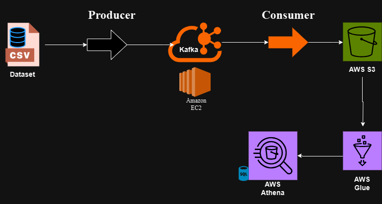

# Stock Market Real-Time Data Engineering Project
The project contains an end-to-end Data Engineering project that processes real-time stock market data using Apache Kafka, AWS and other technologies. The goal is to simulate, process and analyze stock market data in real time.

# Project Overview

The project simulates real-time stock market data using a CSV dataset and streams the data through Kafka hosted on an AWS EC2 instance. Data is processed using a Kafka consumer and stored in AWS S3. Further processing and analytics are performed using AWS Glue and Athena.

### Technologies Used
- **Python**: For data simulation, Kafka producer, and consumer scripts.
- **Apache Kafka**: For real-time data streaming.
- **Amazon EC2**: To host Kafka and run producer/consumer scripts.
- **AWS S3**: To store processed data.
- **AWS Glue**: To clean and transform data.
- **AWS Athena**: For querying and analyzing data.
- **SQL**: For querying the data in Athena.

## Workflow

1. **Amazon EC2 Setup**:
   - Kafka is installed and hosted on EC2 instance to handle real-time data streaming.

2. **Data Simulation**:
   - A CSV dataset is used to simulate real-time stock market data.
   - The Kafka producer sends this data to a Kafka topic on the EC2 instance.

3. **Real-Time Streaming**:
   - The Kafka consumer reads data from the topic on EC2 and stores it in AWS S3.

4. **Data Processing**:
   - AWS Glue processes the raw data and prepares it for analysis.

5. **Data Analysis**:
   - AWS Athena queries the processed data to extract insights.
     
  
## Project Architecture

### Workflow Diagram
The project's workflow is represented in the diagram below:

